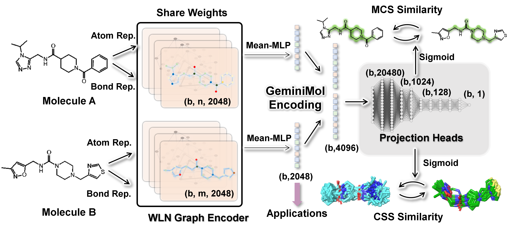

# GeminiMol

  

## Download models

Due to file size limitations, the models were stored in the [Google Driver](https://drive.google.com/drive/folders/183WGytS-zy_POlLxEvijEtarow56zmnz?usp=drive_link) and [HuggingFace](https://huggingface.co/AlphaMWang). This includes all Cross-Encoder and GeminiMol models in the paper.

To use these models, put them under the ```${GeminiMol}/models/```.

## Citing this work

**Conformational Space Profile Enhances Generic Molecular Representation Learning**     
Lin Wang, Shihang Wang, Hao Yang, Shiwei Li, Xinyu Wang, Yongqi Zhou, Siyuan Tian, Lu Liu, Fang Bai    
*Advanced Science*, 2024; doi: 10.1002/advs.202403998

## Get in Touch

We welcome community contributions of extension tools based on the GeminiMol model, etc. If you have any questions not covered in this overview, please contact the [GeminiMol Developer Team](Wanglin1102@outlook.com). We would like to hear your feedback and understand how GeminiMol has been useful in your research. Share your stories with [us](Wanglin1102@outlook.com).       

## Acknowledgements

We appreciate the technical support provided by the engineers of the high-performance computing cluster of ShanghaiTech University.  Lin Wang also thanks Jianxin Duan, Gaokeng Xiao, Quanwei Yu, Zheyuan Shen, Shenghao Dong, Huiqiong Li, Zongquan Li, and Fenglei Li for providing technical support, inspiration and help for this work. We express our gratitude to Dr. Zhongji Pu, Dr. Quanwei Yu for their invaluable assistance in third-party testing for model installation, reproducibility and application.       

We also thank the developers and maintainers of MarcoModel and PhaseShape modules in the Schrödinger package. Besides, GeminiMol communicates with and/or references the following separate libraries and packages, we thank all their contributors and maintainers!    

*  [_RDKit_](https://www.rdkit.org/)
*  [_PyTorch_](https://pytorch.org/)
*  [_AutoGluon_](https://auto.gluon.ai/stable/index.html)
*  [_DGL-Life_](https://lifesci.dgl.ai/)
*  [_ODDT_](https://oddt.readthedocs.io/en/latest/)
*  [_SciPy_](https://scipy.org/)
*  [_scikit-learn_](https://scikit-learn.org/stable/)
*  [_matplotlib_](https://matplotlib.org/)
